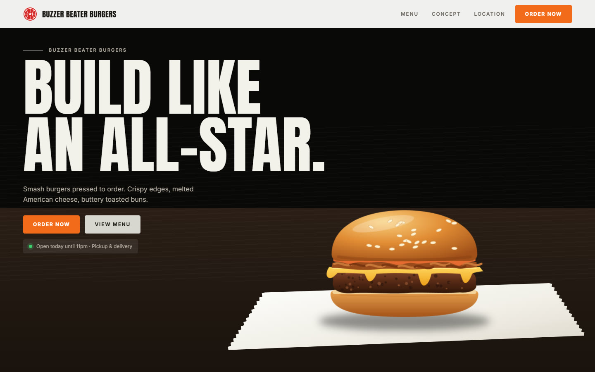
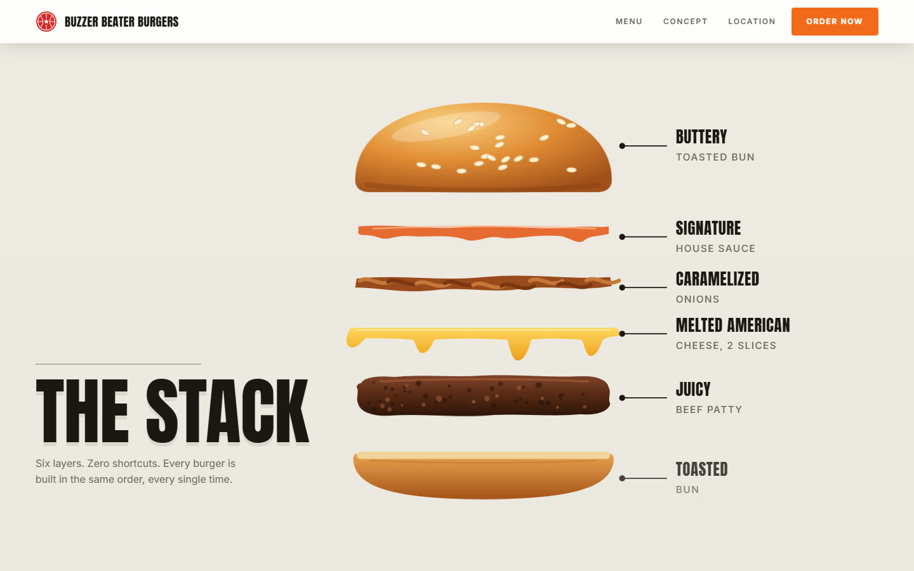
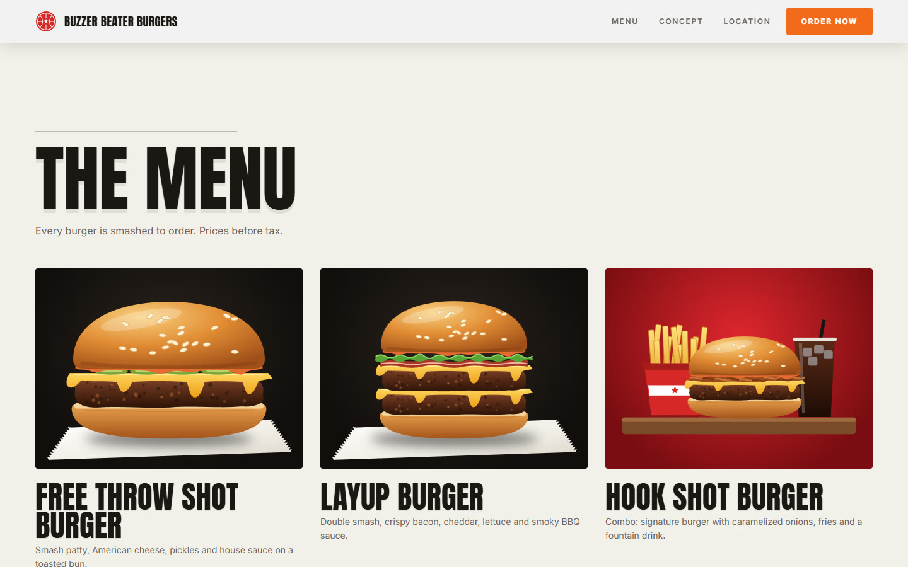
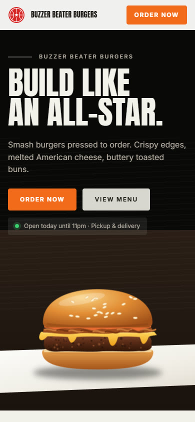

# Landing page de hamburgueria (modelo)

Modelo de página única para hamburgueria, com tema de basquete, animação de rolagem e cardápio
montado a partir de um arquivo de configuração. É HTML, CSS e JavaScript puros: não tem build,
não tem dependência e abre com dois cliques no `index.html`.



| The Stack (abre camada por camada ao rolar) | Cardápio | Celular |
|---|---|---|
|  |  |  |

## O que tem na página

1. **Topo** com logo, menu e botão de pedido fixo.
2. **Hero** escuro com o título "Build like an All-Star." entrando linha por linha e o hambúrguer flutuando sobre o papel manteiga.
3. **The Stack**: a seção fica presa na tela e o hambúrguer se desmonta conforme a rolagem, com o nome de cada camada.
4. **Game Day Combo**: caixa de entrega aberta com hambúrguer, fritas, molhos e milkshake.
5. **Overtime Shakes**: a caixa fechada com a marca.
6. **Cardápio** em grade, com preço por tamanho e botão de pedido em cada item.
7. **Faixa** com texto gigante correndo, **endereço e contato**, e rodapé.

Todas as imagens são ilustrações SVG desenhadas em código (`js/arte/`). Não há foto de
terceiro no repositório, então não há licença de imagem para resolver antes de compartilhar.

## Como abrir

- Dois cliques no `index.html`, ou
- um servidor local qualquer na pasta, por exemplo `npx serve .` ou `python -m http.server`.

As fontes (Anton e Inter) vêm do Google Fonts. Sem internet, a página usa as fontes do sistema.

## Como personalizar

Quase tudo o que muda de uma hamburgueria para outra está em **`js/config.js`**:

| Campo | O que controla |
|---|---|
| `marca.nome` | nome no topo, no hero, no título da aba e no rodapé |
| `marca.caixaLinha1`, `marca.caixaLinha2` | as duas linhas impressas nas caixas de entrega (a primeira se ajusta sozinha à largura) |
| `marca.slogan` | frase da caixa e do rodapé |
| `pedido.url` | destino de **todos** os botões "Order now": link do WhatsApp, iFood, site de pedidos |
| `contato` | endereço, horário, telefone e e-mail |
| `moeda` | formato dos preços; para real use `{ locale: 'pt-BR', codigo: 'BRL' }` |
| `pilha` | as camadas da seção The Stack, de cima para baixo, com os rótulos |
| `cardapio` | os itens: nome, descrição, ilustração e lista de preços |

Camadas de hambúrguer disponíveis: `pao-topo`, `molho`, `alface`, `tomate`, `cebola`, `bacon`,
`picles`, `queijo`, `carne`, `pao-base`. Ilustrações de cardápio: `hamburguer` (com as camadas
que você listar), `combo`, `fritas`, `batata-recheada` e `milkshake` (sabor `chocolate`,
`morango` ou `baunilha`).

Os textos das seções (títulos e parágrafos) ficam no `index.html`. As cores e as fontes ficam
nas variáveis do começo de `css/estilo.css`.

### Trocar ilustração por foto

Em qualquer bloco com `data-ilustracao`, apague o atributo e coloque uma `` dentro. Para
os cartões do cardápio, troque a chamada `A.item(...)` da função `cartao` em `js/main.js` por
uma `` com a foto do item.

## Publicar no GitHub Pages

1. Crie o repositório no GitHub e envie esta pasta.
2. Em **Settings > Pages**, escolha **Deploy from a branch**, branch `main`, pasta `/ (root)`.
3. Em um ou dois minutos a página fica em `https://<usuario>.github.io/<repositorio>/`.

Como não há build, qualquer hospedagem de site estático serve (Netlify, Vercel, Cloudflare Pages).

## Estrutura

```
index.html            estrutura e textos das seções
css/estilo.css        visual, animações e versões para tela pequena
js/config.js          marca, contato, moeda, pilha e cardápio
js/arte/base.js       utilitários e gradientes das ilustrações
js/arte/hamburguer.js as camadas do hambúrguer e a montagem da pilha
js/arte/comida.js     logo, fritas, batata recheada, milkshake e refrigerante
js/arte/cenas.js      hero, pilha, caixas de entrega e imagens do cardápio
js/main.js            liga tudo: textos, cardápio, faixa e animações de rolagem
assets/favicon.svg    ícone da aba
docs/                 imagens deste README
```

## Acessibilidade

- Respeita `prefers-reduced-motion`: com movimento reduzido, nada anima e a pilha aparece já aberta.
- As ilustrações têm `aria-label`, e os botões e links têm foco visível pelo teclado.

## Origem e licença

O layout foi recriado a partir de um vídeo de demonstração de um site gerado no Emergent
(seções, ordem, tipografia, cardápio e preços). Nenhum código, imagem ou arquivo do original foi
copiado: o código e as ilustrações deste repositório são novos. A marca do vídeo, "All Star
Burgers", é usada por restaurantes reais, por isso este modelo usa um nome fictício,
"Buzzer Beater Burgers", que se troca no `js/config.js`.

Licença MIT, veja [LICENSE](LICENSE).
