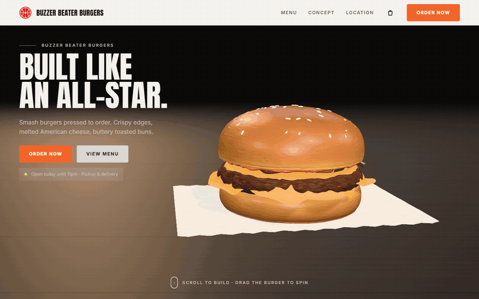
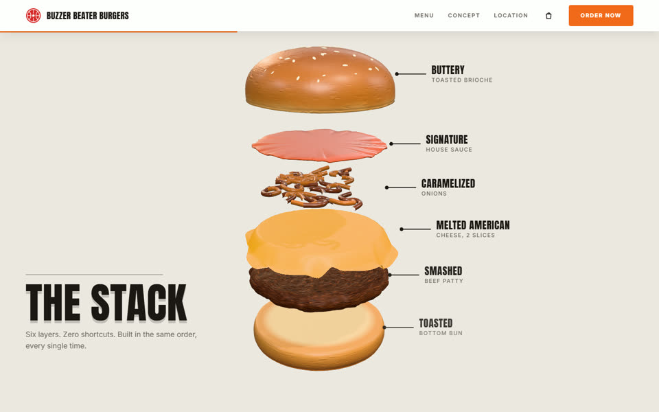
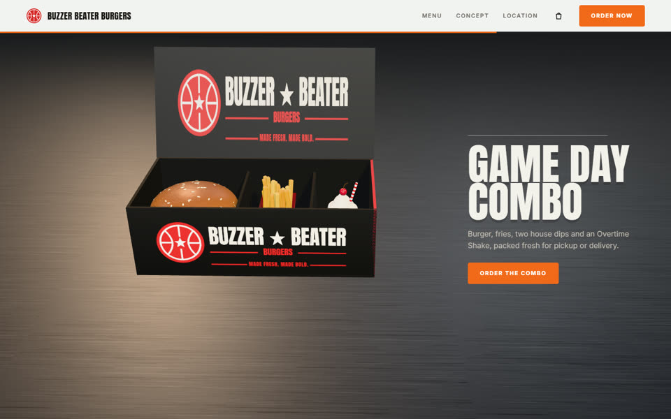
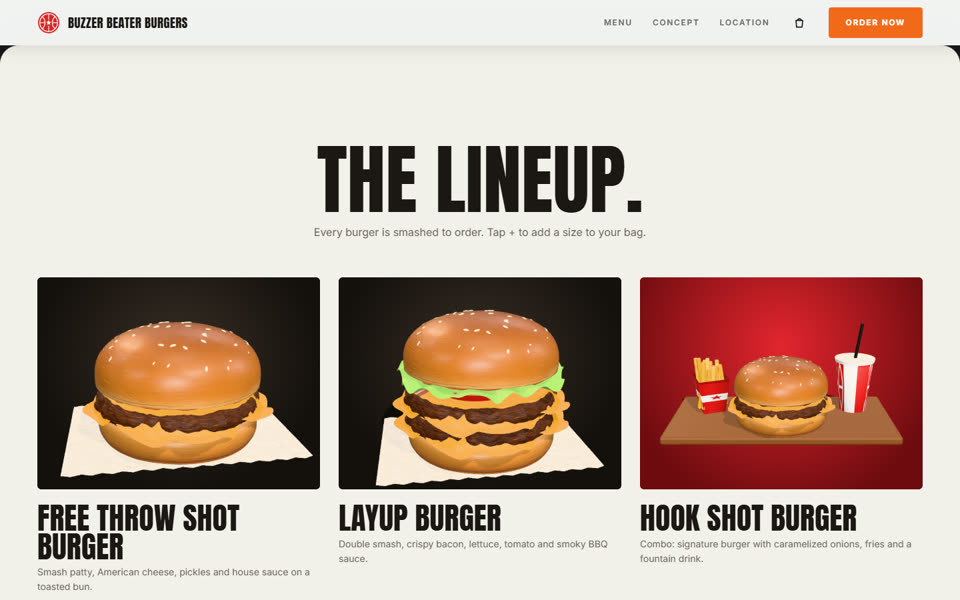
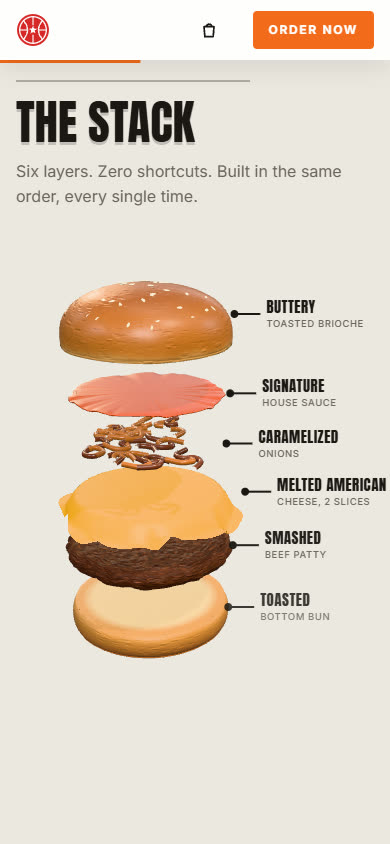

<div align="center">

# 🍔 Landing page 3D de hamburgueria

**Modelo gratuito e de código aberto: um hambúrguer em 3D que gira, explode em camadas e cai
dentro da caixa de entrega conforme a pessoa rola a página.**

[**Ver ao vivo**](https://333xandelz.github.io/landing-hamburgueria/) ·
[**Usar este modelo**](https://github.com/333xandelz/landing-hamburgueria/generate) ·
[**Baixar o site pronto**](https://github.com/333xandelz/landing-hamburgueria/releases/latest)




</div>

## O que vem pronto

| Parte | O que acontece |
|---|---|
| **Topo** | O hambúrguer gira sozinho sobre o papel manteiga, numa mesa de madeira. Com o mouse, **arraste para girar**. |
| **Smashed to order** | Ao rolar, ele levanta do papel, dá uma volta inteira e começa a se separar. |
| **The Stack** | O fundo clareia e a pilha abre, com o nome de cada camada. **Passe o mouse numa camada** e ela se destaca. |
| **Acompanhamentos** | A pilha se fecha e fritas, molhos e milkshake chegam voando, flutuando em volta. |
| **Game Day Combo** | Balcão de inox, a caixa sobe e cada item cai no seu compartimento; o hambúrguer amassa um pouco ao cair. |
| **Overtime Shakes** | A tampa fecha e a câmera mostra a caixa de frente, com a marca. |
| **The Lineup** | O cardápio sobe por cima da cena. As fotos dos itens são renderizadas dos mesmos modelos 3D. |
| **Sacola** | Botão **+** em cada tamanho, a foto voa até a sacola e o pedido fecha numa **mensagem pronta no WhatsApp**. |

Tudo é desenhado em código: geometria, texturas, luz, sombra e reflexo. **Não há foto, modelo 3D
nem imagem de terceiro no repositório**, então não existe licença de imagem para resolver antes
de usar no seu projeto ou no de um cliente.

| The Stack | Game Day Combo | Cardápio | Celular |
|---|---|---|---|
|  |  |  |  |

## Comece em três minutos

### Só quero ver ou mostrar para alguém

Baixe o `index.html` da [última versão](https://github.com/333xandelz/landing-hamburgueria/releases/latest)
e dê dois cliques. É um arquivo único, com tudo dentro, que abre sem instalar nada e sem servidor.

### Quero usar como base do meu site

1. Clique em [**Use this template**](https://github.com/333xandelz/landing-hamburgueria/generate)
   (ou faça um fork, ou baixe o ZIP).
2. Instale o [Node.js](https://nodejs.org) 20.19 ou 22.12 em diante.
3. Na pasta do projeto:

```bash
npm install
npm run dev        # abre em http://localhost:5173 e recarrega a cada alteração
```

Quando estiver do seu jeito, `npm run build` gera o `dist/index.html`, que é o site pronto para
publicar ou mandar para alguém.

## Deixe com a cara da sua hamburgueria

Quase tudo fica em um arquivo só, o **`src/config.js`**:

| Campo | O que muda |
|---|---|
| `marca.nome` | nome no topo, no título da aba e no rodapé |
| `marca.caixaLinha1`, `caixaLinha2`, `slogan` | o que vem impresso na caixa 3D (a linha 1 encolhe sozinha para caber) |
| `pedido.whatsapp` | seu número com DDI e DDD, só dígitos (ex.: `5511999999999`); a sacola fecha o pedido no WhatsApp |
| `pedido.url` | para onde vai o checkout quando não há WhatsApp (iFood, site de pedidos) |
| `contato` | endereço, horário, telefone e e-mail |
| `moeda` | formato dos preços; para real use `{ locale: 'pt-BR', codigo: 'BRL' }` |
| `pilha` | as camadas do hambúrguer da cena, de cima para baixo, com os rótulos |
| `cardapio` | os itens: nome, descrição, ilustração 3D e preço de cada tamanho |

Um item do cardápio é assim:

```js
{
  nome: 'Layup Burger',
  descricao: 'Double smash, crispy bacon, lettuce, tomato and smoky BBQ sauce.',
  ilustracao: { tipo: 'hamburguer', camadas: ['pao-topo', 'molho', 'alface', 'tomate', 'bacon', 'queijo', 'carne', 'pao-base'] },
  precos: [
    { rotulo: 'Single', valor: 9.19 },
    { rotulo: 'Double', valor: 13.79 }
  ]
}
```

- **Camadas disponíveis:** `pao-topo`, `molho`, `alface`, `tomate`, `cebola`, `bacon`, `picles`,
  `queijo`, `carne`, `pao-base`. Repita `queijo` e `carne` para fazer um duplo.
- **Ilustrações do cardápio:** `hamburguer` (com as camadas que você listar), `combo`, `fritas`,
  `batata-recheada` e `milkshake` (sabor `chocolate`, `morango` ou `baunilha`).
  `fundo: 'vermelho'` troca o fundo do cartão.
- **Textos das seções** (títulos e parágrafos) ficam no `index.html`. Os textos vêm em inglês,
  como no site de referência; para português, é só trocar ali e no `config.js`.
- **Cores e fontes** ficam nas variáveis do começo de `src/estilo.css`.
- **Câmera e tempo de cada etapa** ficam em `src/cena/coreografia.js`, com um conjunto para tela
  deitada e outro para tela em pé.

## Publique de graça

**GitHub Pages (já configurado).** O workflow `.github/workflows/pages.yml` compila e publica a
cada push na branch `main`. No seu repositório, vá em **Settings > Pages** e, em **Source**,
escolha **GitHub Actions**. O site fica em `https://<seu-usuario>.github.io/<repositorio>/`.

**Netlify, Vercel ou Cloudflare Pages.** Rode `npm run build` e arraste a pasta `dist` para o
[Netlify Drop](https://app.netlify.com/drop), ou conecte o repositório com o comando
`npm run build` e a pasta `dist`.

**Seu próprio servidor.** O `dist/index.html` é um arquivo único com caminhos relativos: funciona
em qualquer pasta de qualquer hospedagem.

## Como funciona por dentro

Um único `<canvas>` fica fixo atrás da página. A seção da experiência tem dez telas de altura, e
uma linha do tempo do GSAP é amarrada à rolagem (ScrollTrigger com `scrub`): rolar para baixo
avança a animação, rolar para cima volta. A cada quadro, o estado da linha do tempo vira posição
de câmera, abertura da pilha, cor do fundo e opacidade da mesa e do balcão.

| Tempo da linha | Etapa |
|---|---|
| 0 a 2,3 | levanta do papel, gira e começa a se separar |
| 2,3 a 4,4 | fundo claro, pilha aberta com rótulos |
| 4,5 a 5,4 | a pilha fecha e os acompanhamentos chegam voando |
| 5,6 a 7,6 | balcão de inox, a caixa sobe e os itens caem nos compartimentos |
| 7,7 a 10 | a tampa fecha e a câmera mostra a caixa de frente |

```
index.html                  estrutura e textos das seções
src/config.js               marca, pedido, contato, moeda, pilha e cardápio
src/main.js                 liga tudo: textos, cardápio, sacola, rolagem suave e a cena
src/estilo.css              visual, painéis, cardápio, sacola e versões de tela
src/cena/coreografia.js     a linha do tempo da rolagem
src/cena/iniciar.js         monta a cena e atualiza tudo a cada quadro
src/cena/hamburguer.js      as camadas do hambúrguer, modeladas em código
src/cena/acompanhamentos.js fritas, batata recheada, molhinhos, milkshake e refrigerante
src/cena/caixa.js           caixa de entrega com compartimentos e tampa articulada
src/cena/cenario.js         mesa de madeira, papel manteiga e balcão de inox
src/cena/texturas.js        todas as texturas, desenhadas em canvas
src/cena/palco.js           renderizador, câmera, luzes e laço de quadros
src/cena/rotulos.js         rótulos HTML que seguem as camadas 3D
src/cena/interacao.js       arrastar para girar e destacar a camada sob o mouse
src/cena/miniaturas.js      fotos do cardápio renderizadas dos modelos
src/ui/                     cardápio, sacola e utilitários
```

Bibliotecas: [three.js](https://threejs.org) (3D), [GSAP](https://gsap.com) com ScrollTrigger
(coreografia), [Lenis](https://lenis.darkroom.engineering) (rolagem suave),
[Vite](https://vite.dev) com [vite-plugin-singlefile](https://github.com/richardtallent/vite-plugin-singlefile)
(build em arquivo único).

## Acessibilidade e desempenho

- Com `prefers-reduced-motion`, a rolagem suave, o giro automático e os balanços desligam; a
  cena continua seguindo a rolagem, que é comandada pela própria pessoa.
- Sem WebGL, a página vira uma rolagem comum com os textos de todas as seções.
- A cena para de desenhar quando o cardápio cobre a tela, e a resolução fica limitada a 2x.

## Problemas comuns

**Abri o `index.html` e apareceu "Este arquivo é o código-fonte".** É o `index.html` da raiz, que
precisa do Vite. Use o botão **Abrir o site** do aviso, abra `dist/index.html` (depois de
`npm run build`) ou rode `npm run dev`.

**O 3D demora alguns segundos para aparecer.** As fotos do cardápio são renderizadas na hora em
que a página abre. Com placa de vídeo é rápido; em máquina sem aceleração gráfica pode levar mais.

**O botão de checkout não faz nada.** Preencha `pedido.whatsapp` ou `pedido.url` no
`src/config.js`.

## Origem e licença

A coreografia e o layout foram recriados a partir de um vídeo de demonstração de um site gerado
no Emergent: o hambúrguer no papel, a pilha explodida, a queda na caixa, a tampa fechando e o
cardápio. Nenhum código, imagem ou arquivo do original foi copiado. A marca do vídeo, "All Star
Burgers", é usada por restaurantes reais; por isso este modelo usa o nome fictício "Buzzer Beater
Burgers".

Licença MIT: use, altere e venda à vontade, inclusive em projetos de clientes. Veja [LICENSE](LICENSE).
