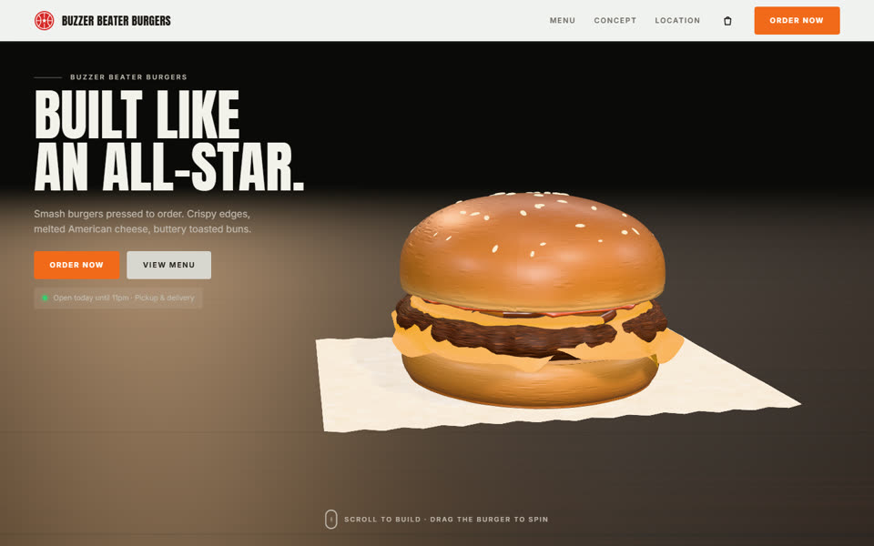
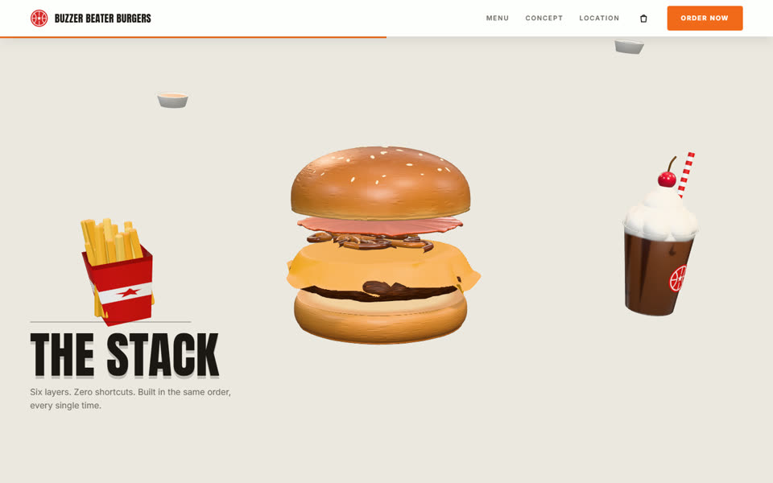
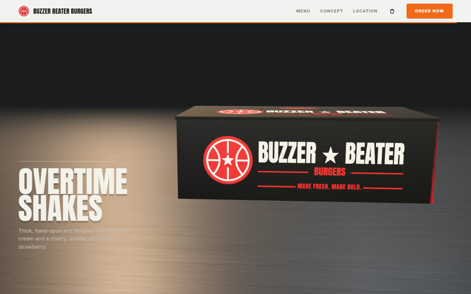
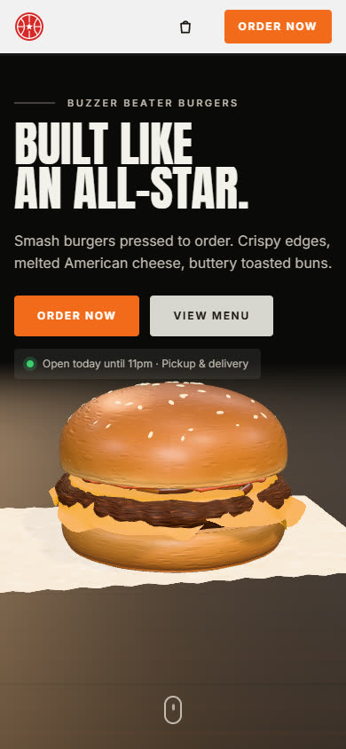

# Landing page 3D de hamburgueria (modelo)

Modelo de página única para hamburgueria, com tema de basquete e uma cena **3D em tempo real**
conduzida pela rolagem: o hambúrguer levanta do papel manteiga, gira, explode camada por
camada, os acompanhamentos chegam voando, tudo cai dentro da caixa de entrega e a tampa fecha.
Depois vem o cardápio, com sacola de pedido que fecha pelo WhatsApp.



| The Stack | Acompanhamentos | Game Day Combo |
|---|---|---|
|  |  |  |
| **Overtime Shakes** | **The Lineup** | **Celular** |
|  |  |  |

## O que a página faz

| Parte | O que acontece |
|---|---|
| Topo | Hambúrguer 3D girando sozinho sobre o papel manteiga, numa mesa de madeira. Com o mouse, **arraste para girar**. |
| Smashed to order | Ao rolar, ele levanta, dá uma volta inteira e começa a se separar. |
| The Stack | O fundo clareia e a pilha abre com o nome de cada camada. **Passe o mouse numa camada** para destacá-la. |
| Acompanhamentos | A pilha se fecha e fritas, molhos e milkshake chegam voando, flutuando em volta. |
| Game Day Combo | Balcão de inox, a caixa sobe e cada item cai no seu compartimento (o hambúrguer amassa um pouco ao cair). |
| Overtime Shakes | A tampa fecha e a câmera mostra a caixa de frente. |
| The Lineup | Painel claro sobe por cima da cena com o cardápio. As fotos dos itens são renderizadas dos mesmos modelos 3D. |
| Sacola | Botão **+** em cada tamanho, a miniatura voa até a sacola, e o pedido fecha numa mensagem pronta do WhatsApp. |

Tudo é desenhado em código (geometria, texturas em canvas, luz, sombra e reflexo): **não há
foto, modelo 3D nem imagem de terceiro no repositório**, então não há licença de imagem para
resolver antes de compartilhar.

## Como rodar

Precisa de [Node.js](https://nodejs.org) 20.19 ou 22.12 em diante (exigência do Vite 8).

```bash
npm install
npm run dev        # abre em http://localhost:5173
npm run build      # gera dist/index.html, um arquivo só com tudo dentro
npm run preview    # serve o dist/ para conferir o build
```

O `dist/index.html` abre com **dois cliques**, sem servidor, e é o arquivo mais fácil de
mandar para alguém ver. O `index.html` da raiz é o código-fonte: aberto direto do disco, o
navegador bloqueia os scripts, e por isso ele mostra um aviso explicando como abrir o site.

## Como personalizar

Quase tudo o que muda de uma hamburgueria para outra está em **`src/config.js`**:

| Campo | O que controla |
|---|---|
| `marca.nome` | nome no topo, no título da aba e no rodapé |
| `marca.caixaLinha1`, `marca.caixaLinha2`, `marca.slogan` | o que vem impresso na caixa 3D (a linha 1 encolhe sozinha para caber) |
| `pedido.whatsapp` | número com DDI e DDD, só dígitos (ex.: `5511999999999`): a sacola fecha o pedido no WhatsApp |
| `pedido.url` | destino do checkout quando não há WhatsApp (iFood, site de pedidos) |
| `contato` | endereço, horário, telefone e e-mail |
| `moeda` | formato dos preços; para real use `{ locale: 'pt-BR', codigo: 'BRL' }` |
| `pilha` | as camadas do hambúrguer da cena, de cima para baixo, com os rótulos |
| `cardapio` | os itens: nome, descrição, ilustração 3D e preços por tamanho |

Camadas disponíveis: `pao-topo`, `molho`, `alface`, `tomate`, `cebola`, `bacon`, `picles`,
`queijo`, `carne`, `pao-base`. Ilustrações do cardápio: `hamburguer` (com as camadas que você
listar), `combo`, `fritas`, `batata-recheada` e `milkshake` (sabor `chocolate`, `morango` ou
`baunilha`); `fundo: 'vermelho'` troca o fundo do cartão.

Os textos das seções ficam no `index.html`; cores e fontes nas variáveis do começo de
`src/estilo.css`. Os enquadramentos de câmera e o tempo de cada etapa ficam em
`src/cena/coreografia.js` (um conjunto para tela deitada e outro para tela em pé).

## Publicar no GitHub Pages

O repositório já traz o workflow `.github/workflows/pages.yml`, que compila e publica a cada
push na branch `main`:

1. Crie o repositório no GitHub e envie esta pasta.
2. Em **Settings > Pages**, em **Source**, escolha **GitHub Actions**.
3. O próximo push (ou **Actions > Publicar no GitHub Pages > Run workflow**) publica em
   `https://<usuario>.github.io/<repositorio>/`.

O build usa caminhos relativos, então o `dist/` também funciona em Netlify, Vercel, Cloudflare
Pages ou numa subpasta de qualquer servidor.

## Estrutura

```
index.html                  estrutura e textos das seções
src/config.js               marca, pedido, contato, moeda, pilha e cardápio
src/main.js                 liga tudo: textos, cardápio, sacola, rolagem suave e a cena
src/estilo.css              visual, painéis, cardápio, sacola e versões de tela
src/cena/iniciar.js         monta a cena e atualiza tudo a cada quadro
src/cena/coreografia.js     a linha do tempo da rolagem (GSAP ScrollTrigger)
src/cena/hamburguer.js      as camadas do hambúrguer, modeladas em código
src/cena/acompanhamentos.js fritas, batata recheada, molhinhos, milkshake e refrigerante
src/cena/caixa.js           caixa de entrega com compartimentos e tampa articulada
src/cena/cenario.js         mesa de madeira, papel manteiga e balcão de inox
src/cena/texturas.js        todas as texturas, desenhadas em canvas
src/cena/palco.js           renderizador, câmera, luzes e laço de quadros
src/cena/rotulos.js         rótulos HTML que seguem as camadas 3D
src/cena/interacao.js       arrastar para girar e destacar a camada sob o mouse
src/cena/miniaturas.js      fotos do cardápio renderizadas dos modelos
src/ui/                     cardápio, sacola e utilitários
.github/workflows/pages.yml publicação automática no GitHub Pages
```

Bibliotecas: [three.js](https://threejs.org) (3D), [GSAP](https://gsap.com) com ScrollTrigger
(coreografia), [Lenis](https://lenis.darkroom.engineering) (rolagem suave) e
[Vite](https://vite.dev) (build).

## Acessibilidade e desempenho

- Com `prefers-reduced-motion`, a rolagem suave, o giro automático e os balanços desligam; a
  cena continua seguindo a rolagem, que é comandada pela própria pessoa.
- Sem WebGL, a página vira uma rolagem comum com os textos de todas as seções.
- A cena para de desenhar quando o cardápio cobre a tela. A resolução fica limitada a 2x.

## Origem e licença

A coreografia e o layout foram recriados a partir de um vídeo de demonstração de um site gerado
no Emergent (hambúrguer no papel, a pilha explodida, a queda na caixa, a tampa fechando e o
cardápio). Nenhum código, imagem ou arquivo do original foi copiado. A marca do vídeo, "All Star
Burgers", é usada por restaurantes reais; por isso este modelo usa o nome fictício "Buzzer
Beater Burgers", que se troca no `src/config.js`.

Licença MIT, veja [LICENSE](LICENSE).
